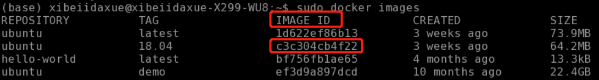
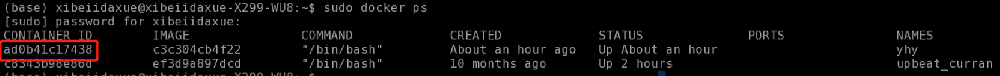

# 如何配置javascriptFuzzing环境

## 1、Docker

### 1.1、安装docker：[参考](https://www.cnblogs.com/loveyoul9/p/11438627.html)

```shell
# 自行安装
```

#### 1.1.1、下载镜像：

```shell
sudo docker pull ubuntu:18.04
```

#### 1.1.2、创建docker容器：

```shell
# -i: 以交互模式运行容器
# -t: 为容器重新分配一个伪输入终端，通常与 -i 同时使用；
# -v: 表示需要将本地哪个目录挂载到容器中
# -d: 后台运行容器，并返回容器ID；
# 将c3c304cb4f22换成自己的Ubuntu18.04镜像的IMAGE ID
sudo docker run -itdv /root/software/:/mnt/software/ c3c304cb4f22 /bin/bash
# 不将宿主机挂载到docker中
# sudo docker run -itd c3c304cb4f22 /bin/bash
```






#### 1.1.3、修改容器名字：（可选）

```shell
docker rename 容器原名  容器新名
```


#### 1.1.4、启动容器

```shell
# docker exec从容器中退出后，容器不会停止
docker exec -it ad0b41c17438 /bin/bash
```


#### 1.1.5、服务器重启后，如何重启docker容器

``` shell
# 列出所有container
docker container ls -a
# 启动相应的docker
docker container start xxxxyyyyzzzz
```


#### 1.1.7、docker将容器存储为docker镜像

``` shell
docker commit <当前运行的container id> <仓库名称>:<tag>
```


#### 1.1.7、补充：

##### 1.1.7.1、查看docker容器中linux的版本

```shell
cat /etc/issue
```


##### 1.1.7.2、容器打包：

​	参考 ： [Docker之export/import使用](https://blog.csdn.net/weixin_42003671/article/details/86614577)


##### 1.1.7.3、解决运行docker命令要用sudo的问题

​	[参考](https://www.jianshu.com/p/1354e0506753)


## 1.2、更换安装源：Ubuntu-18.04 国内镜像源（阿里云）

安装vim：

```shell
apt-get update
apt-get install vim
```

安装vim时若出现以下异常，则修改`/tmp`文件夹的权限。

```shell
chmod 1777 /tmp
```

异常信息：

```shell
Get:1 http://security.ubuntu.com/ubuntu bionic-security InRelease [88.7 kB]
Get:3 http://archive.ubuntu.com/ubuntu bionic-updates InRelease [88.7 kB]
Err:1 http://security.ubuntu.com/ubuntu bionic-security InRelease   
  Couldn't create temporary file /tmp/apt.conf.poD1m4 for passing config to apt-key
Err:3 http://archive.ubuntu.com/ubuntu bionic-updates InRelease
  Couldn't create temporary file /tmp/apt.conf.xYUS6c for passing config to apt-key
Get:4 http://archive.ubuntu.com/ubuntu bionic-backports InRelease [74.6 kB]
Err:4 http://archive.ubuntu.com/ubuntu bionic-backports InRelease
  Couldn't create temporary file /tmp/apt.conf.O4QjtM for passing config to apt-key
Get:2 http://archive.ubuntu.com/ubuntu bionic InRelease [242 kB]
Err:2 http://archive.ubuntu.com/ubuntu bionic InRelease                                                                                              
  Couldn't create temporary file /tmp/apt.conf.H7xfAb for passing config to apt-key
```

备份：
``` shell
cp /etc/apt/sources.list /etc/apt/sources.list.bak
```

清空source.list:
```shell
echo > /etc/apt/sources.list
```

将如下信息复制到文件中：/etc/apt/sources.list

```
deb http://mirrors.aliyun.com/ubuntu/ bionic main restricted universe multiverse
deb-src http://mirrors.aliyun.com/ubuntu/ bionic main restricted universe multiverse

deb http://mirrors.aliyun.com/ubuntu/ bionic-security main restricted universe multiverse
deb-src http://mirrors.aliyun.com/ubuntu/ bionic-security main restricted universe multiverse

deb http://mirrors.aliyun.com/ubuntu/ bionic-updates main restricted universe multiverse
deb-src http://mirrors.aliyun.com/ubuntu/ bionic-updates main restricted universe multiverse

deb http://mirrors.aliyun.com/ubuntu/ bionic-proposed main restricted universe multiverse
deb-src http://mirrors.aliyun.com/ubuntu/ bionic-proposed main restricted universe multiverse

deb http://mirrors.aliyun.com/ubuntu/ bionic-backports main restricted universe multiverse
deb-src http://mirrors.aliyun.com/ubuntu/ bionic-backports main restricted universe multiverse
```


## 2、安装引擎

### 1、安装[v8](https://github.com/v8/v8)

```shell
# 从github下载仓库
git clone https://github.com/v8/v8.git
# 国内网无法下载，自行解决
git clone https://chromium.googlesource.com/chromium/tools/depot_tools.git
```


安装Hermes：

```shell
apt-get -y install cmake git ninja-build libicu-dev python zip libreadline-dev
git clone https://github.com/facebook/hermes.git
hermes/utils/build/configure.py
```


### 2、[jerryscript](https://github.com/jerryscript-project/jerryscript)

需要安装anaconda：（国内使用清华源）

```shell
wget https://mirrors.tuna.tsinghua.edu.cn/anaconda/archive/Anaconda3-2020.02-Linux-x86_64.sh && bash Anaconda3-2020.02-Linux-x86_64.sh
```

安装依赖

```shell
# -f 修复当前系统中各个软件间的依赖关系
# -y 跳过系统提示，直接安装
sudo apt-get -y -f install gcc gcc-arm-none-eabi cmake cppcheck vera++ python awk bc find sed
```


### 3、spiderMonkey

[参考](https://developer.mozilla.org/en-US/docs/Mozilla/Projects/SpiderMonkey/Build_Documentation)

常见问题解决：

> **1、Exception: Could not detect environment shell !**
>
> 解决方案：
>
> ```jsx
> export SHELL=/bin/bash
> ```


### 4、[duktape](https://duktape.org/)

参考[方案](https://duktape.org/guide.html#gettingstarted)

### 5、[MuJS](https://mujs.com/)

参考[方案](https://mujs.com/)

```shell
# 下载源码并解压
wget https://mujs.com/downloads/mujs-1.3.2.tar.xz
tar -xvf mujs-1.3.2.tar.xz
cd mujs-1.3.2
# 编译安装
make
# 测试
./build/release/mujs testcase.js
```


## n、安装操作系统常用的基础软件：

```shell
# 更新可用软件包列表 && 安装已经下载的更新
apt-get update && apt-get upgrade
apt-get -f -y install wget vim git software-properties-common
```

```
# 安装openjdk8
add-apt-repository ppa:openjdk-r/ppa
apt-get update 
apt-get -f -y install openjdk-8-jdk
```


安装nodejs:

```shell
curl -sL https://deb.nodesource.com/setup_10.x | bash -
apt-get install -y nodejs
# https://deb.nodesource.com/setup_12.x
# 安装这几个必要的工具，包括编译和精简都需要
# 需要解决docker中全局安装后仍然找不到已经安装的模块的问题，小心！小心！小心！
npm install esprima estraverse escodegen -S -g
# 修改重要文件前先备份
cp /etc/profile /etc/profile.backup
# 将系统nodejs添加系统环境，可以直接使用命令执行
```

> 将下面的语句添加到文件`/etc/profile`末尾：
>
> `export PATH="$PATH:/root/node-v14.2.0-linux-x64/bin"`

==注意，如果这里没有安装esprima estraverse escodegen这是几个模块或者安装失败，会导致变异无法进行且无法按代码块进行精简==


```shell
# 使对配置文件的修改生效
source /etc/profile 
```


linux下配置pip使用国内安装源：[参考](https://www.cnblogs.com/kazihuo/p/11051319.html)

> 修改 ~/.pip/pip.conf (没有就创建一个)， 内容如下：

```shell
[global]
index-url=https://pypi.tuna.tsinghua.edu.cn/simple/ 
```


linux 命令使用vpn: 安装教程

> 遇见如下错误，解决方案。[参考]([https://www.socketprohc.com/hc/zh-cn/articles/360022001091-%E5%AE%89%E8%A3%85Linux%E5%AE%A2%E6%88%B7%E7%AB%AF](https://www.socketprohc.com/hc/zh-cn/articles/360022001091-安装Linux客户端))
>
> ss-local: error while loading shared libraries: libpcre.so.1: cannot open shared object file: No such file or directory

将使用命令`find / -name “libpcre.so.1”`查找含有`libpcre.so.1`链接库的目录，将目录添加到文件`/etc/ld.so.conf`的后面。问题解决。


# pycharm 远程调试docker 中的Python脚本

## 一、启动容器时将docker中的ssh端口22映射到服务器中的1024端口

```shell
docker run -itdv /home/nisl1/nisl8121/yhy:/home/swap -p 1024:22 fc512f0dff04 /bin/bash
```

## 二、修改容器内部

```shell
# 启动容器
docker exec -it 容器名 /bin/bash
```

#### 1、修改root用户密码：

```shell
passwd
```

#### 2、安装openssh-server和openssh-client

```shell
apt-get install openssh-server
apt-get install openssh-client
# 安装软件时会出现找不到安装包的问题，将容器的安装源改为中科大的安装源
vim /etc/apt/sources.list
```

```shell
# 中科大安装源
deb https://mirrors.ustc.edu.cn/ubuntu/ bionic main restricted universe multiverse
deb-src https://mirrors.ustc.edu.cn/ubuntu/ bionic main restricted universe multiverse
deb https://mirrors.ustc.edu.cn/ubuntu/ bionic-updates main restricted universe multiverse
deb-src https://mirrors.ustc.edu.cn/ubuntu/ bionic-updates main restricted universe multiverse
deb https://mirrors.ustc.edu.cn/ubuntu/ bionic-backports main restricted universe multiverse
deb-src https://mirrors.ustc.edu.cn/ubuntu/ bionic-backports main restricted universe multiverse
deb https://mirrors.ustc.edu.cn/ubuntu/ bionic-security main restricted universe multiverse
deb-src https://mirrors.ustc.edu.cn/ubuntu/ bionic-security main restricted universe multiverse
deb https://mirrors.ustc.edu.cn/ubuntu/ bionic-proposed main restricted universe multiverse
deb-src https://mirrors.ustc.edu.cn/ubuntu/ bionic-proposed main restricted universe multiverse
```

#### 3、修改SSH配置文件以下选项

```shell
vim /etc/ssh/sshd_config

# PermitRootLogin prohibit-password # 默认打开 禁止root用户使用密码登陆，需要将其注释
# RSAAuthentication yes #启用 RSA 认证, 我的容器会显示重复了，所以我注释了
PubkeyAuthentication yes #启用公钥私钥配对认证方式
PermitRootLogin yes #允许root用户使用ssh登录
```

#### 4、启动sshd服务

```shell
/etc/init.d/ssh restart
```

####  5、退出容器，连接测试

```shell
# 此处把ip地址改为该服务器的ip地址，用户名是docker的root,端口号对应于与docker容器映射的端口号
# 此时可以直接通过客户端登陆容器了
ssh root@127.0.0.1 -p 1024
```

## 三、使用Pycharm远程连接

参考：[本地Pycharm项目放到远程Ubuntu服务器上跑](https://blog.csdn.net/qq_28193019/article/details/103147649)

记得将端口号修改为之前的端口号1024，可参考[使用Pycharm远程连接](https://blog.csdn.net/hanchaobiao/article/details/84069299)


# 附加：零星学习

### 1、如何以相对项目根目录的方式获取资源？

设置环境变量workspace的路径为项目的根目录

# 项目相关的命令

启动分析bug的web服务的命令：

``` bash
/usr/local/apache-tomcat-7.0.47/bin/startup.sh
```

